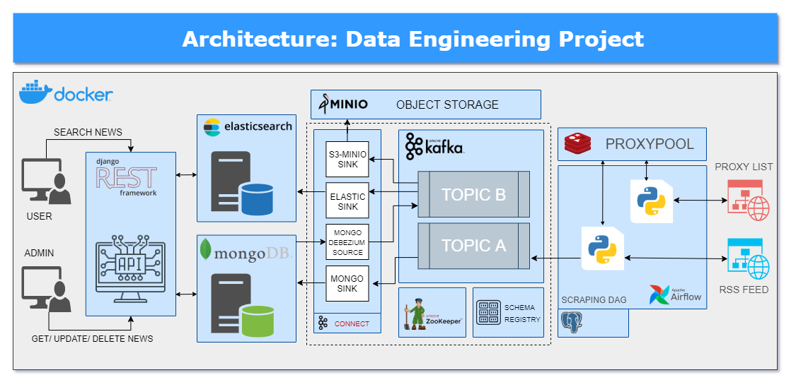

# NewsStream

NewsStream is an event-driven news ingestion and search platform. It periodically collects RSS feeds, persists news records in MongoDB, streams changes through Kafka, indexes them in Elasticsearch, archives them in MinIO, and exposes a read-only search API.

> This repository is configured for local development. Replace default credentials and do not expose Kafka or Elasticsearch directly in production.

## Architecture



The diagram is the project's conceptual architecture. The current Compose implementation has two intentional differences:

- The REST API is implemented with **FastAPI**, not Django REST Framework.
- Kafka runs in **KRaft mode**, so ZooKeeper is not part of the running stack.
- The current API is read-only; the create, update, and delete operations pictured in the conceptual diagram are not exposed.

### Event flow

```text
RSS feeds
  → Airflow scraping DAG
  → Kafka topic: rss_news
  → MongoDB sink connector
  → MongoDB: newsdb.news
  → Debezium MongoDB source connector (CDC)
  → Kafka topic: newsstream.newsdb.news
  → Elasticsearch sink connector → Search API
  → MinIO S3 sink connector → Raw JSON archive
```

The following Kafka Connect connectors are provisioned automatically when the stack starts:

- `mongodb-news-sink`: writes `rss_news` records to `newsdb.news`.
- `debezium-mongodb-source`: captures MongoDB change events and publishes `newsstream.newsdb.news`.
- `elasticsearch-news-sink`: maintains the Elasticsearch search index.
- `minio-news-sink`: writes JSON files to the `news-raw` bucket, partitioned by UTC time.

## Services

| Service | Purpose | Host port |
|---|---|---:|
| Airflow | RSS scheduling and pipeline administration | 8080 |
| FastAPI | Read-only news search API | 8000 |
| Kafka Connect | MongoDB, Debezium, Elasticsearch, and MinIO connectors | 8083 |
| Schema Registry | Avro schema registry | 8081 |
| Elasticsearch | Search-oriented read model | 9200 |
| Kibana | Elasticsearch data exploration | 5601 |
| MongoDB | Primary document store; replica set `rs0` | 27017 |
| MinIO | Object storage and console | 9000, 9001 |
| Kafka | Event streaming; externally reachable listener | 9094 |

## Prerequisites

- Docker Desktop configured for Linux containers and Docker Compose v2.
- Python 3.11 or later for running tests on the host.

## Quick start

From the repository root:

```powershell
docker compose up -d --build
docker compose ps
```

Wait until services report `healthy` or `Up`, then open:

- API documentation: <http://localhost:8000/docs>
- Airflow: <http://localhost:8080> (`admin` / `admin`, development only)
- Kibana: <http://localhost:5601>
- MinIO Console: <http://localhost:9001> (`minioadmin` / `minioadmin123`, development only)

Verify the API and its two primary connectors:

```powershell
Invoke-RestMethod http://localhost:8000/health

docker compose exec -T connect curl -fsS `
  http://localhost:8083/connectors/debezium-mongodb-source/status

docker compose exec -T connect curl -fsS `
  http://localhost:8083/connectors/elasticsearch-news-sink/status
```

For each connector, both `connector.state` and its task `state` should be `RUNNING`.

## API

The API reads from Elasticsearch only; it does not write to MongoDB, Kafka, or Elasticsearch.

| Endpoint | Description |
|---|---|
| `GET /health` | API and Elasticsearch cluster health check |
| `GET /news` | News search, filtering, sorting, and pagination |
| `GET /news/{id}` | Get one news article by document ID |
| `GET /news/facets` | Source and language facets |

Examples:

```powershell
Invoke-RestMethod "http://localhost:8000/news?q=AI&language=vi&page=1&page_size=20&sort=relevance"

Invoke-RestMethod "http://localhost:8000/news?source=vnexpress&sort=published_at_desc"

Invoke-RestMethod "http://localhost:8000/news/facets?language=vi"
```

`GET /news` accepts `q`, `source`, `language`, `published_from`, `published_to`, `page`, `page_size`, and `sort`. See the OpenAPI documentation for request and response schemas.

## Elasticsearch search model

The index template matches `newsstream.newsdb.news*`.

- Full-text search: `title`, `description`.
- Exact filtering and aggregations: `source`, `language`, `url`.
- Date filtering and sorting: `published_at`, `scraped_at`.

The current mapping uses Elasticsearch's default analyzer. Vietnamese accent-insensitive search, autocomplete, synonyms, and semantic search are not implemented yet.

## Airflow configuration

Airflow environment variable examples are available in [airflow/.env.example](airflow/.env.example). Common settings include:

```text
PROXY_ENABLED=false
PROXY_POOL_SIZE=10
KAFKA_BOOTSTRAP_SERVERS=kafka:9092
KAFKA_TOPIC=rss_news
```

The `news_scrape_pipeline` DAG runs every 10 minutes. Set `PROXY_ENABLED=true` when proxy collection and rotation are required.

## Testing and quality checks

Install test and development dependencies:

```powershell
python -m pip install -r api\requirements-dev.txt
python -m pip install -r airflow\requirements-dev.txt
python -m pip install ruff black
```

Run the checks used by CI:

```powershell
ruff check .
black --check .
python -m pytest api\tests -q
python -m pytest airflow\tests -m "not integration" -q
docker compose config --quiet
docker compose build api airflow connect
```

The RSS → Kafka → MongoDB integration test requires a running stack:

```powershell
$env:RUN_INTEGRATION = "1"
python -m pytest airflow\tests\integration -m integration -q
```

## Continuous integration

The GitHub Actions workflow is defined in [.github/workflows/ci.yml](.github/workflows/ci.yml). It runs on every push and pull request and performs:

- Docker Compose configuration validation.
- API unit tests on Python 3.12.
- Airflow unit tests on Python 3.11, excluding integration tests.
- Docker builds for `api`, `airflow`, and `connect`.

## Troubleshooting

### Docker Desktop returns HTTP 500

This is usually a local Docker Engine issue, not a Compose configuration error. Restart Docker Desktop, then run:

```powershell
docker version
docker compose up -d
docker compose ps
```

### A connector is `FAILED` after MongoDB or Elasticsearch stops

If a dependency remains unavailable long enough, Kafka Connect can terminate a task. Once the dependency is healthy, restart only failed tasks:

```powershell
docker compose exec -T connect curl -sS -X POST `
  "http://localhost:8083/connectors/debezium-mongodb-source/restart?includeTasks=true&onlyFailed=true"

docker compose exec -T connect curl -sS -X POST `
  "http://localhost:8083/connectors/elasticsearch-news-sink/restart?includeTasks=true&onlyFailed=true"
```

Debezium stores its offsets and resume token; the Elasticsearch sink stores Kafka offsets. A successful restart resumes processing from committed offsets.

## Stop the stack

```powershell
docker compose down
```

This preserves Docker volumes. Use `docker compose down -v` only when you intentionally want to remove all local MongoDB, Kafka, Elasticsearch, MinIO, and Postgres data.
